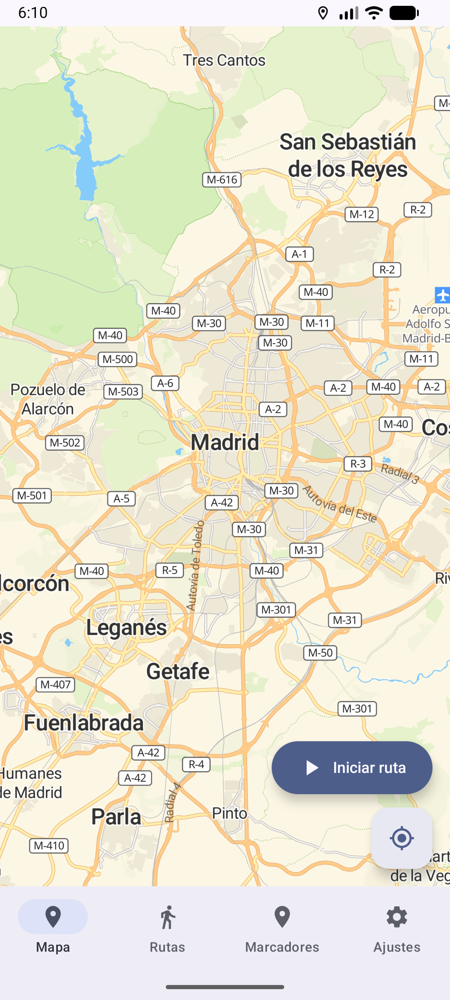
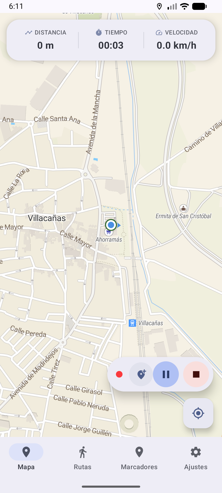
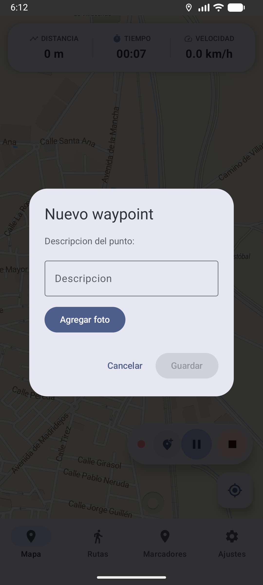
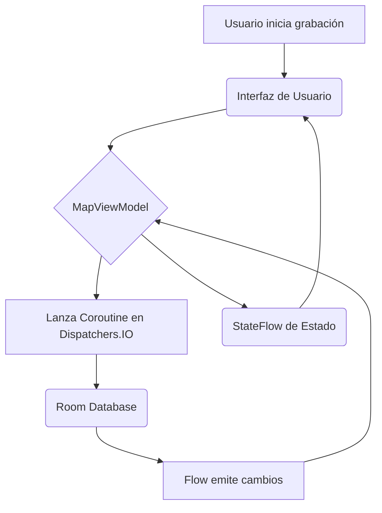

# Rutas MapLibre - Documentación del Proyecto

Este documento detalla la arquitectura, decisiones de diseño y funcionalidades de la aplicación Rutas MapLibre, un tracker de rutas GPS para Android centrado en la privacidad y el rendimiento.

---

## ¿Qué problema resuelve esta aplicación?

Las aplicaciones de seguimiento de rutas más populares (Strava, WikiLoc, etc.) dependen de la nube, lo que significa que nuestros datos de localización se almacenan en servidores de terceros. Esta aplicación nace como una alternativa que prioriza la privacidad: **todas las rutas y datos se guardan exclusivamente en el dispositivo**.

El objetivo es ofrecer una herramienta potente y fluida para entusiastas del senderismo, ciclismo o cualquier actividad al aire libre, sin obligarles a ceder el control sobre su información personal.

---

## Funcionalidades Principales

- **Grabación de Rutas GPS:** Seguimiento en tiempo real con cálculo de distancia, duración y velocidad media.
- **Waypoints con Fotos:** Posibilidad de añadir marcadores en el mapa durante una grabación, adjuntando una descripción y una fotografía.
- **Gestión de Rutas Locales:** Todas las rutas grabadas se almacenan en una base de datos local para su consulta offline.
- **Importación y Exportación GPX:** Carga rutas desde archivos `.gpx` y exporta tus propias grabaciones para compartirlas o visualizarlas en otros programas.
- **Intervalo de Grabación Ajustable:** Permite al usuario configurar la frecuencia de muestreo del GPS (de 1 a 30 segundos) para encontrar el equilibrio perfecto entre precisión y consumo de batería.

---

## Capturas de Pantalla

| Pantalla Principal | Grabación en Curso | Detalle de Waypoint |
| :---: | :---: | :---: |
|  |  |  |

---

## Arquitectura y Decisiones Técnicas

La aplicación se construyó siguiendo el patrón **MVVM (Model-View-ViewModel)**, una decisión clave para separar la lógica de negocio de la interfaz de usuario y facilitar las pruebas y el mantenimiento.

- **`View` (Jetpack Compose):** La interfaz es 100% declarativa. Los componentes `Composable` no tienen lógica, simplemente observan un `StateFlow` del ViewModel y se "recomponen" cuando el estado cambia. Esto evita por completo la manipulación manual de vistas (como `TextView.setText()`), resultando en un código de UI más predecible.

- **`ViewModel` (`MapViewModel.kt`):** Es el cerebro de la aplicación. Orquesta las acciones del usuario (ej. "iniciar grabación"), procesa los datos del GPS, actualiza la base de datos a través de coroutines y expone el estado actual a la UI. No sabe nada sobre Jetpack Compose, solo emite estados.

- **`Model` (Room DB):** La capa de datos está formada por la base de datos Room (`AppDatabase.kt`). En lugar de hacer consultas directas, los DAOs exponen `Flows`. Esto significa que en cuanto un dato cambia en la base de datos (ej. se añade un nuevo punto a una ruta), el `Flow` emite el cambio, que es recogido por el ViewModel y, finalmente, la UI se actualiza automáticamente. Es un flujo de datos totalmente reactivo.



---

## Desafíos Técnicos y Soluciones

1.  **El Problema: Integrar una Vista tradicional (MapLibre) en una UI declarativa (Compose)**

    -   **Descripción:** MapLibre es un SDK excelente, pero está basado en el sistema de Vistas de Android, no en Compose. No se puede usar directamente como un `Composable`.
    -   **Solución:** La solución fue usar el `AndroidView`. Este `Composable` especial actúa como un puente, permitiendo "incrustar" una Vista de Android dentro de una jerarquía de Compose. La clave fue gestionar manualmente el ciclo de vida del `MapView` (`onCreate`, `onStart`, `onResume`, etc.) dentro de un `DisposableEffect`, que se encarga de limpiar todo cuando el `Composable` desaparece de la pantalla para evitar fugas de memoria.

2.  **El Problema: La grabación de GPS se detenía en segundo plano**

    -   **Descripción:** Android es muy agresivo a la hora de optimizar la batería y tiende a detener procesos que consumen recursos (como el GPS) cuando la aplicación no está en primer plano.
    -   **Solución:** En lugar de solicitar una única actualización de la ubicación, implementé un `LocationCallback` que se registra con el `FusedLocationProviderClient`. Este callback se configura con una prioridad alta (`PRIORITY_HIGH_ACCURACY`) y un intervalo definido por el usuario. El ViewModel se encarga de iniciar y detener este callback, asegurando que el flujo de datos de localización sea constante mientras la grabación esté activa.

---

## Limitaciones y Problemas Conocidos

- **Sin datos de Altitud:** La aplicación actualmente solo registra latitud y longitud. No procesa ni muestra datos de elevación, por lo que no se pueden generar perfiles de altitud de las rutas.
- **Dependencia de Google Play Services:** La geolocalización se basa en el `FusedLocationProvider` de Google. En dispositivos sin los servicios de Google (como algunas tablets o dispositivos Huawei recientes), la funcionalidad de GPS no operará correctamente.
- **Compatibilidad de GPX:** Aunque el parser de GPX es robusto, podría fallar al importar archivos con formatos XML muy específicos o no estándar que no fueron contemplados durante el desarrollo.

---

## Cómo Compilar y Ejecutar

1.  **Clonar el Repositorio:**
    ```bash
    git clone https://github.com/O-Isaac/rutas-maplibre.git
    ```

2.  **Configurar la API Key:**
    El proyecto necesita una clave de **MapTiler** para poder descargar los mapas. Debes crear un archivo `secrets.properties` en la raíz del proyecto y añadir tu clave.
    
    ```properties
    # Este archivo NO debe subirse a Git
    MAPTILER_API_KEY="TU_API_KEY_DE_MAPTILER_AQUI"
    ```

3.  **Compilar con Gradle:**
    Abre el proyecto en Android Studio (Iguana o superior) y ejecuta la tarea de Gradle desde la terminal:
    ```bash
    ./gradlew assembleDebug
    ```

---

## Permisos Solicitados

- `android.permission.INTERNET`: **¿Por qué?** Para descargar los datos del mapa (teselas) desde el servidor de MapTiler.
- `android.permission.ACCESS_FINE_LOCATION`: **¿Por qué?** Es el permiso principal para acceder a las coordenadas precisas del GPS, fundamental para la grabación de rutas.
- `android.permission.ACCESS_COARSE_LOCATION`: **¿Por qué?** Permite obtener una ubicación aproximada, que puede ser útil para centrar el mapa inicialmente sin necesidad de esperar al posicionamiento fino del GPS.
- `android.permission.ACCESS_NETWORK_STATE`: **¿Por qué?** Para comprobar si el dispositivo tiene conexión a internet antes de intentar descargar los mapas.

---

### Autor

- **Isaac Zaragoza Mendoza**
- **GitHub:** [O-Isaac](https://github.com/O-Isaac)
- **Email:** zaragozamendozaisaac@gmail.com

*Última actualización: 22/02/2026*  
*Estado del proyecto: Completado - Listo para producción*
